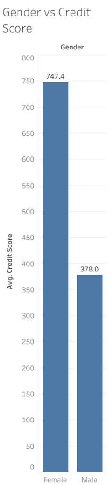
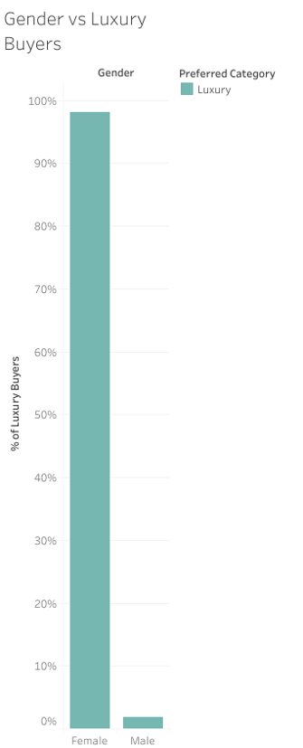
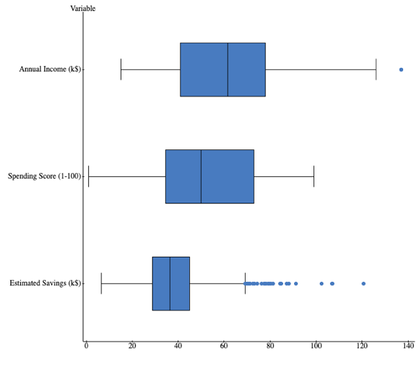

# 📊 Analyzing Consumer Behavior for Marketing Insights

This project explores how demographic, financial, and behavioral factors influence consumer purchasing patterns and how these insights can be applied to create targeted marketing strategies. Using Kaggle’s Mall Customers dataset, I cleaned and prepared the data in Excel, performed descriptive analysis and boxplots in StatCrunch, and visualized patterns in Tableau. The dataset includes demographic variables (gender, age group), financial indicators (annual income, credit score, savings), and behavioral features (loyalty years, preferred category, spending score).

Key findings show that female customers tend to have higher credit scores on average, they are more likely to prefer luxury purchases, and while income level affects product category preferences, it does not directly determine overall spending scores. These insights suggest that effective marketing campaigns should combine demographic and behavioral segmentation for stronger personalization and targeting. The repository includes raw and cleaned datasets, Tableau and StatCrunch visualizations, and a full PDF report with analysis and interpretations.

## Dashboard Preview

📄 [Download Full Report](./reports/analyzing_consumer_behavior_for_marketing_insights_project.pdf)

**Author:** Georgia Iferi Itam — Data Analytics Student, Ivy Tech Community College | DBMS 260 – Advanced Data Analytics

